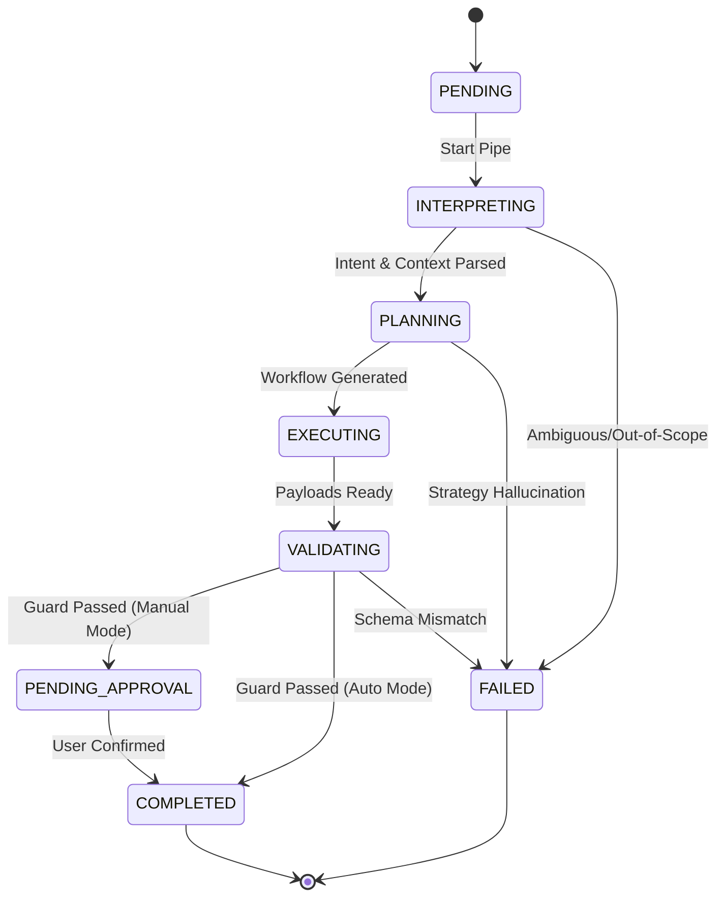

# 🏗️ OpsAI — Infrastructure Audit Report

---

## 1. Database Architecture (PostgreSQL)

To support the robust state-machine logic required for multi-stage AI orchestration, the following relational schema is established. We use `jsonb` for flexible data storage where appropriate while maintaining strict types for status tracking.

### 1.1 Core Tables (DDL)

```sql
-- Enums for strict state control
CREATE TYPE orchestration_status AS ENUM (
    'PENDING', 
    'INTERPRETING', 
    'PLANNING', 
    'EXECUTING', 
    'VALIDATING', 
    'PENDING_APPROVAL', 
    'COMPLETED', 
    'FAILED'
);

CREATE TYPE step_type AS ENUM (
    'COMMUNICATION', 
    'COORDINATION', 
    'TASK_CREATION', 
    'DATA_RETRIEVAL'
);

-- Main Orchestration Table
CREATE TABLE orchestrations (
    id UUID PRIMARY KEY DEFAULT gen_random_uuid(),
    raw_input TEXT NOT NULL,
    intent VARCHAR(50), -- Map to Intents Enum in Spec
    status orchestration_status DEFAULT 'PENDING',
    created_at TIMESTAMP WITH TIME ZONE DEFAULT CURRENT_TIMESTAMP,
    updated_at TIMESTAMP WITH TIME ZONE DEFAULT CURRENT_TIMESTAMP
);

-- Workflow Instances (The Plan)
CREATE TABLE workflow_instances (
    id UUID PRIMARY KEY DEFAULT gen_random_uuid(),
    orchestration_id UUID REFERENCES orchestrations(id) ON DELETE CASCADE,
    steps JSONB NOT NULL, -- Array of Step objects
    version INTEGER DEFAULT 1,
    created_at TIMESTAMP WITH TIME ZONE DEFAULT CURRENT_TIMESTAMP
);

-- Context Snapshots (Working Memory)
CREATE TABLE context_snapshots (
    id UUID PRIMARY KEY DEFAULT gen_random_uuid(),
    orchestration_id UUID REFERENCES orchestrations(id) ON DELETE CASCADE,
    stage orchestration_status NOT NULL,
    data JSONB NOT NULL, -- The "Context" object at this specific stage
    created_at TIMESTAMP WITH TIME ZONE DEFAULT CURRENT_TIMESTAMP
);
```

---

## 2. State Machine Logic

The orchestration flow is managed by a deterministic state transition model. Every successful layer completion triggers a `context_snapshot` and a status update.



---

## 3. API Gateway & Status Streaming

To deliver the "Calm AI" experience, the API Gateway must support asynchronous status updates.

### 3.1 Pattern: Server-Sent Events (SSE)
Instead of a standard `POST` wait, the system will return a `202 Accepted` with an `orchestration_id`. The client then listens to an SSE endpoint for stage updates.

**Endpoint:** `GET /api/orchestrate/:id/stream`  
**Events:**
- `stage_update`: `{ "stage": "PLANNING", "status": "IN_PROGRESS" }`
- `context_delta`: `{ "new_entities": ["Acme Corp"] }`
- `result`: `{ "status": "COMPLETED", "payload": [...] }`

---

## 4. Security & Secrets Strategy

OpsAI interacts with high-privilege systems (Email, Jira, Calendar). 

### 4.1 Integration Vault
Tokens should **never** enter the AI context or the `context_snapshots` table.
- **Workflow:** 
    1. AI generates a `TASK_CREATION` payload.
    2. The **Dispatch Service** intercepts the payload.
    3. The service fetches the encrypted API key from the environment/Vault using a standard lookup key (e.g., `JIRA_API_KEY`).
    4. The service signs and sends the request.

### 4.2 PII Guardrails
Context snapshots containing PII (emails, names) must be stored in a **PII-Encrypted** column or a separate encrypted table if compliance (GDPR/SOC2) is a priority.

---

## 5. Audit Conclusion

The current infrastructure design is **State-Machine Ready**. By using PostgreSQL enums and indexed UUIDs, the system can handle concurrent orchestrations with full traceability. 

**Next Action:** Proceed to **Sprint 0** to initialize the database and basic API scaffolding.
