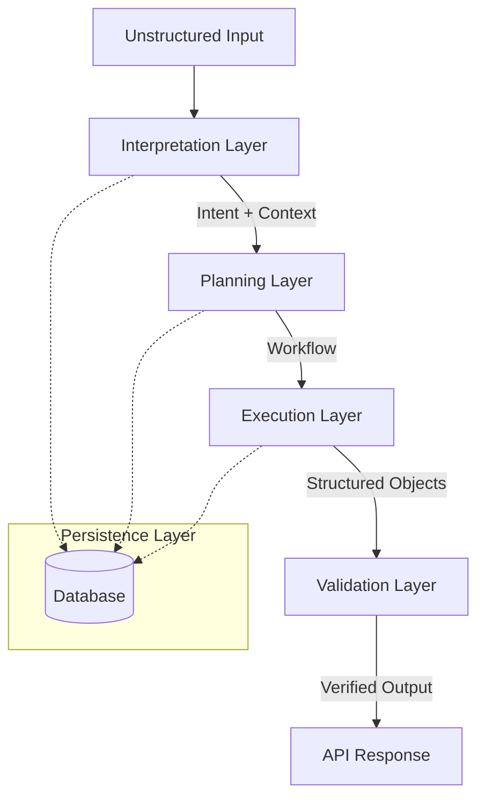

# 📄 OpsAI — System Specification

---

## 1. Overview

OpsAI is a robust, AI-first workflow engine designed to transform ambiguous natural language inputs into structured, deterministic, and executable operations. 

Unlike traditional chatbots or RAG systems that prioritize generation, OpsAI prioritizes **orchestration**. It treats AI as a component in a strictly typed pipeline, ensuring that every output is validated, persisted, and ready for real-world execution.

---

## 2. Design Principles

### AI as an Orchestrator
The system's primary role is not to answer questions, but to decide and structure the next sequence of actions.

### Boundaries as Contracts
Every layer in the system operates under a strict Input/Output contract. If a layer cannot satisfy its contract, it must fail explicitly rather than propagate ambiguity.

### Immutable Context
State is preserved in a "Working Memory" (Context) that flows through the pipeline. This ensured that entities extracted early are available to later layers without re-interpretation.

### Atomic Validation
Validation is not a final step; it is a boundary check performed at the transition of every layer.

---

## 3. Architecture

### Multi-Stage Pipeline
The system utilizes a linear pipeline where each stage adds value and structure.



### Layer Responsibilities

| Layer | Responsibility | Pattern |
| :--- | :--- | :--- |
| **Interpretation** | Intent extraction & entity parsing | `Classifier` |
| **Planning** | Workflow strategy generation | `Strategy` |
| **Execution** | Concrete output generation (Tasks, Emails) | `Command` |
| **Validation** | Schema and logic enforcement | `Guard` |

---

## 4. Layer Definitions & Contracts

### 4.1 Interpretation Layer
**Input:** Raw string input.  
**Output:** `Intent` and initial `Context`.

**Intents (Enum):**
- `CLIENT_ONBOARDING`
- `MEETING_COORDINATION`
- `FOLLOW_UP_MANAGEMENT`
- `AMBIGUOUS_INPUT` (Triggers clarification)
- `OUT_OF_SCOPE` (Triggers rejection)

---

### 4.2 Planning Layer
**Input:** `Intent` + `Context`.  
**Output:** `Workflow` (Ordered list of Steps).

**Step Types (Enum):**
- `COMMUNICATION` (Email, Slack)
- `COORDINATION` (Calendar, Scheduling)
- `TASK_CREATION` (Jira, Linear)
- `DATA_RETRIEVAL`

---

### 4.3 Execution Layer
**Input:** `Workflow` + `Context`.  
**Output:** `Payloads` (List of structured objects).

This layer maps each step in the workflow to a concrete payload tailored for external systems.

---

## 5. Schema System

### Context Schema (Working Memory)
```json
{
  "context_id": "uuid",
  "entities": {
    "organization": "string | null",
    "contacts": ["string"],
    "dates": ["iso8601"],
    "custom_metadata": "object"
  }
}
```

### Workflow Schema
```json
{
  "workflow_id": "uuid",
  "steps": [
    {
      "id": "string",
      "type": "StepType",
      "action": "string",
      "priority": "LOW | MED | HIGH"
    }
  ]
}
```

---

## 6. Persistence (Data Layer)

OpsAI preserves the state of every orchestration to enable audit trails and retry logic.

### Tables (Relational Model)
- **`orchestrations`**: Tracks input string, intent, and final status.
- **`workflow_instances`**: Stores the generated segments of a workflow.
- **`context_snapshots`**: Stores the working memory at each stage of the pipeline.

---

## 7. API Layer

### POST `/api/orchestrate`

**Request:**
```json
{
  "input": "We signed Acme Corp. Set up a kickoff for Wednesday."
}
```

**Response (Status Streaming):**
The system supports a state-machine response to provide UX visibility into the orchestration process.

```json
{
  "status": "COMPLETED",
  "stages": {
    "interpretation": "SUCCESS",
    "planning": "SUCCESS",
    "execution": "SUCCESS",
    "validation": "SUCCESS"
  },
  "output": {
    "workflow_id": "86a8...",
    "results": [...]
  }
}
```

---

## 8. Sprint Plan (Revised)

### Sprint 1: Interpretation & Context
- Implementation of the `Interpretation` layer.
- Development of the `Context` entity extraction system.
- Initial persistence for raw inputs.

### Sprint 2: Planning & Strategy
- Implementation of the `Planning` layer.
- Definition of `StepType` strategies.
- Workflow generation logic.

### Sprint 3: Execution & Payloads
- Mapping `Workflow Steps` to `Payloads`.
- Generation of structured Task, Email, and Meeting objects.

### Sprint 4: Boundary Validation & Guards
- Implementation of `Atomic Validation` between every layer.
- Error handling for `OUT_OF_SCOPE` and `AMBIGUOUS` inputs.

### Sprint 5: API & Orchestration
- Final assembly of the multi-stage pipeline.
- Persistent state tracking and API response streaming.

---

## 9. Final Positioning

OpsAI is a **System of Record** for AI-driven operations. It bridges the gap between chaotic human intent and structured system execution through rigorous contract enforcement.
